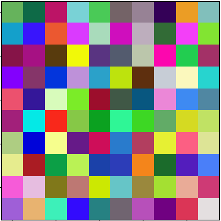
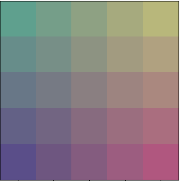

# Tiny SOM - Short but very efficient implementation of Self Organizng Maps

The idea of this library is as follows:

1. Provide easy to understand, short in code, but efficient implementation of SOM.
2. Provide easy to use interface for creating useful visualization that helps to understand your data.
3. Popularize idea of explainability of models and data with usage of not so popular yet very powerful model.

## What is SOM?

SOM, Self Organizing Map or Kohonen Neural Network is Artificial Neural Network that is being trained in unsupervised way.
It's purpose is to create low-dimentional representation of data. Typically 2-dimentional representation is used as it gives possibility for many useful visualizations.


## Use example

```python
from map import Map
import numpy as np
import matplotlib.pyplot as plt
from matplotlib import image


np.random.seed(42)
data = np.random.randint(0, 255, (100, 3))
plt.imshow(data)
```

```python
data = data / data.max()
test_map = Map((5,5),3, 0.01)
test_map.fit(data, 10000)
plt.imshow(test_map.weights)
```



To be continued...


## TODO:

- Create training history 
- Create visualization library for all visualizations
- Create unit tests
- Expand readme
- Publish as pypi package